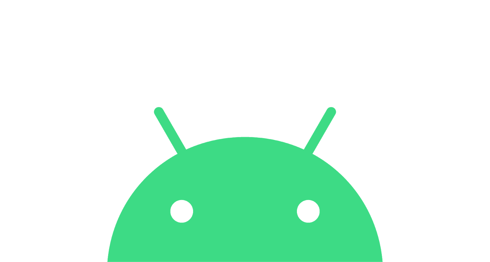

### Hi, I'm Wambui Victor 👋

 
 
I'm a Freelance developer with speciaty in Android App development,UI/UX Design, and Machine Learning (Python). I am outgoing, dedicated,and open-minded. I get across to people and adjust to changes easily. Its my belief that someone should work on developing their professional skills and learning new things all the time.
 
 

- 🌱 I’m currently learning Node.Js
- 👯 I’m a part time Game Developer.
- 💬 Ask me anything about Python.
- 😄 Pronouns: He/His
-

**Languages and Tools**

<code></code>
<code></code>
<code></code>
<code></code>
<code></code>
<code></code>
<code></code>
